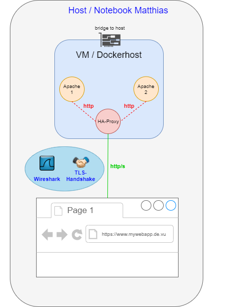

# Dockerized HAProxy with TLS Configuration Provisioned with Vagrant

## Overview

This project is a practical implementation of deploying a HAProxy infront of two Apaches
with Vagrant and Docker. HAProxy is used as a load balancer which proxies the traffic to both Apaches.
The main focus lies on analysing different TLS configurations and improving the load balancer configuration.

***

For detailed information about TLS encryption including the different configuration files in this repository,
see my technical paper ["Extensions of Securing a Web Server with TLS"](docs/Tech-Paper.md)

***

The follwing chapters will focus on the setup of a VM with Vagrant and the testing of TLS 1.2 and 1.3 configurations.

## Requirements

- Vagrant
- VirtualBox

## Overview of System Setup

## VM Provisioning

Run `vagrant up` to start a virtual machine.
Review the output from Vagrant. Check if the `certificate-chain.pem` is generated and three Docker containers are running.

If you want the newest version of Guest Additions on the machine,
you can install the [Vagrant VB Guest Plugin](https://github.com/dotless-de/vagrant-vbguest). The Guest Additons are not required
for the VM.

## Practical Use Case Demos

The following points show what can be done with this setup for testing purposes.

### Access the Web Page

You can access the VM from a private IP address. To find the IP address assigned to the VM
type `vagrant ssh` and after that `ip a` to list all network interfaces.

If everything works fine, a web page is displayed under the ip address. 
You will get a security warning beacuse of the self signed certificate. 
In that case you can add a security exception.

### Try out different HAProxy configuration

The standard provisioning offers a TLS 1.2 based HAProxy configuration.
You can i.e. load a TLS 1.3 HAProxy configuration, which is
also provided in the repository. Change the file in the docker-compose.yml to do so.

You can connect to the VM using the `vagrant ssh` command.

### Test your TLS Configuration with OWASP O-Saft Security Testing Tool

The docker-compose.yml defines a [OWASP O-Saft](https://www.owasp.org/index.php/O-Saft) container
with a command to check the SSL configuration of HAProxy.

To test your configuration you can simply run the following command:

`docker-compose up --no-color osaft | less`

*(`| less` makes the console output scrollable, `| tee <filename>` saves the console output to a file)*

### (Optional: For Deeper Inspection) Record TLS Handshake with Wireshark

You can analyze the whole TLS Handshake with Wireshark.
This guide also works the same with TLS 1.3.

You can also load the prerecorded files from the wireshark folder of this project.

1. Setup a second virtual machine with Linux or
install Wireshark on your host machine.
For the virtual machine, you need to specify the correct
host-only network adapter.
1. To decrypt the last parts of the handshake, set the environment variable
`SSLKEYLOGFILE` to a location your current user has acces to, i.e the home directory:

	`export SSLKEYLOGFILE=$PWD/keys.txt`
1. Open Wireshark
1. Go to `Edit -> Preferences`.
1. In the preference dialog, navigate to `Protocols -> SSL` or `Protocols -> TLS`
1. Set the path to the SSLKEYLOGFILE (the file gets created later on)
1. Start a recording on the matching network interface
1. Use a browser or curl: `curl -k -X GET https://172.28.128.7`
1. Stop the recording and filter for `ssl`
1. You should now be able to see the handshake and also decrypted SSL.
Also check the keys.txt file, to understand what happened.

## Further Tasks not covered in this Repo

- [Unterschied Informationssicherheit und Datenschutz](docs/Unterschied-Datentschutz-Informationssicherheit.md)
