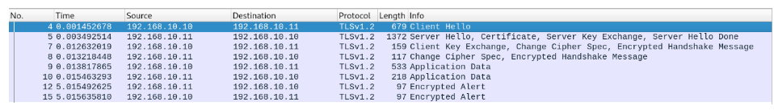
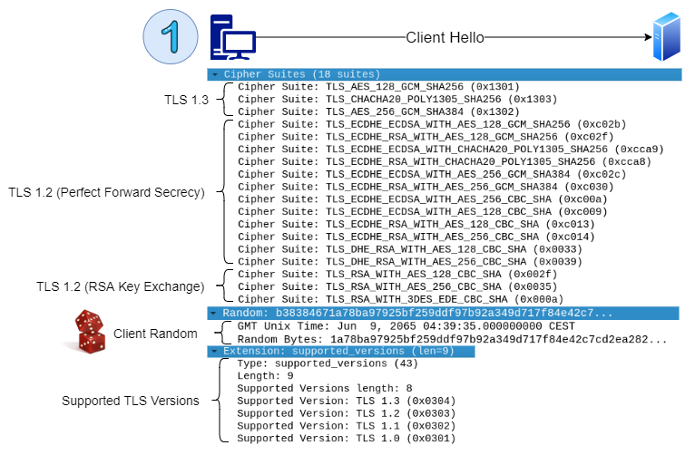
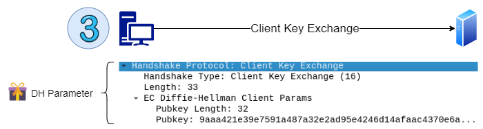
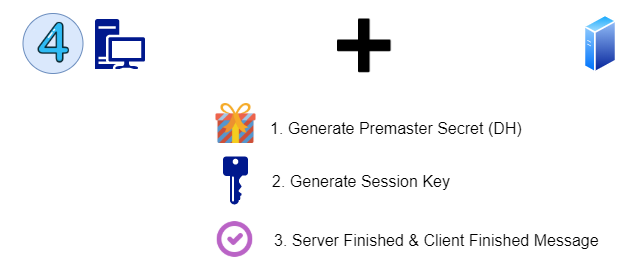

# TechPaper - Extions of Securiy a Web Server 

This Techpaper gives a short overview of how to securely publish a webserver with 'state of the art' technologies in year 2019. 

The author Matthias is a trainee / apprentice in software developement and did a six week stay in the team for information security. This paper should  seen as a documentation for a small technical demo Matthias built during this time in DEC 2019.  

The paper covers the following topics:

- Deployment of a Dockerhost with Vagrant
- Deployment of Docker with Ansible
- Deployment of a TLS secure HaProxy LoadBalancer in front of Apache Containers

## Theory and Basics

This part covers the theory of TLSv1.2 with screenshots of a Wireshark analysis.
Later on, TLS 1.3 will be introduced. 

### TLSv1.2 Handshake with DH Key Exhange

The following images are inspired by the TLS handshake image at https://www.cloudflare.com/learning/ssl/keyless-ssl/

**Overview of a whole TLS Handshake**

**Client Hello** - The client sends its supported TLS versions, **supported cipher suites** and a **client random** to the server.

**Server Hello** - The server generates a **server secret**. It also selects a cipher supported by the client.
If no matching cipher suite can be found, a downgrade happens.

The selected cipher suite in this case is *TLS_ECDHE_RSA_WITH_AES256_GCM_SHA384*. The cipher provides
PFS properties, so if a private key is exposed, active sessions cannot be unencrypted by an attacker.
ECDHE introduces further security because of the discrete logarithm problem.

The server also sends a **public certificate** with a signature.
A certificate gets signed by a certificate authority to provide integrety.

The server chooses its **DH parameters** and signes them with its private key.

If all data is sent, a Server Hello Done message is sent to the client.

**Client Key Exchange** - Der Client übergiebt seine eigenen DH Parameter.

**Generate Session Key** - Client and server generate a **premaster secret** using the DH parameters they agreed on.
The premaster secret is used to generate a symmetric **session key**.

**Symmetric Comunication** - Symmetric encryption is more efficient than asymetric encryption.
Therefore TLS uses a hybrid encryption.

### Benefits of TLS 1.3

- weak cipher suites have been removed
	- favour strong AEAD implementations to assure confidentiallity and authenticity of data
	- no RSA Key Exchange; favour DHE
- more of communication is encrypted
	- all handshake messages after server hello
	- prevents downgrading of cipher suites (FREAK attack)
- less roundtrips in communication
	- DHE can happen at client hello
- predifined DH parameters
	- no weak parameters
	- no small DH parameter
	- prevents LogJam and WeakDH attack
- 0-RTT mode introduced
	- saves roundtrip at client reconnection
	- danger of replay attacks (i.e. a replayed POST request)

To conclude, TLS 1.3 has removed a lot of legacy features, thus providing a stronger protection
for the end-user.

### Remark on TLS 1.3

Although TLS 1.3 strengthens communication for end-users, there are cybersecurity challenges.
Because of the short being of TLS 1.3, there are no good tooling and guidelines for companies yet.
However, the new TLS version may become relevant in near future,
so rethinking cybersecurity aspects is recommended. For further details check the article from Kaspersky.
(https://www.kaspersky.com/blog/secure-futures-magazine/tls-1-3-network/28278/)

## Implementation and Code Examples

### Automated Provsioning (Vagrant, Ansible, Docker)

The following vagrant file does ...

Please see notes in code for further details

## Configuration HaProxy and TLS

## Index Of Abbreviations

| Abbrevitation | Meaning |
|-|-|
| DHE | Diffie Hellmann Exchange |
| ECDHE | Elliptic-curve Diffie-Hellman |
| PFS | Perfect Forward Secrecy |

## Furher Reading

- https://www.owasp.org/images/b/bd/Richtig_verschluesseln_mit_SSL%2BTLS.pdf
(Presentation of the OWASP O-Saft Tool and recommandations for strong encryption)
- https://www.bsi.bund.de/SharedDocs/Downloads/DE/BSI/Publikationen/TechnischeRichtlinien/TR02102/BSI-TR-02102-2.pdf?__blob=publicationFile&v=7 (German)
