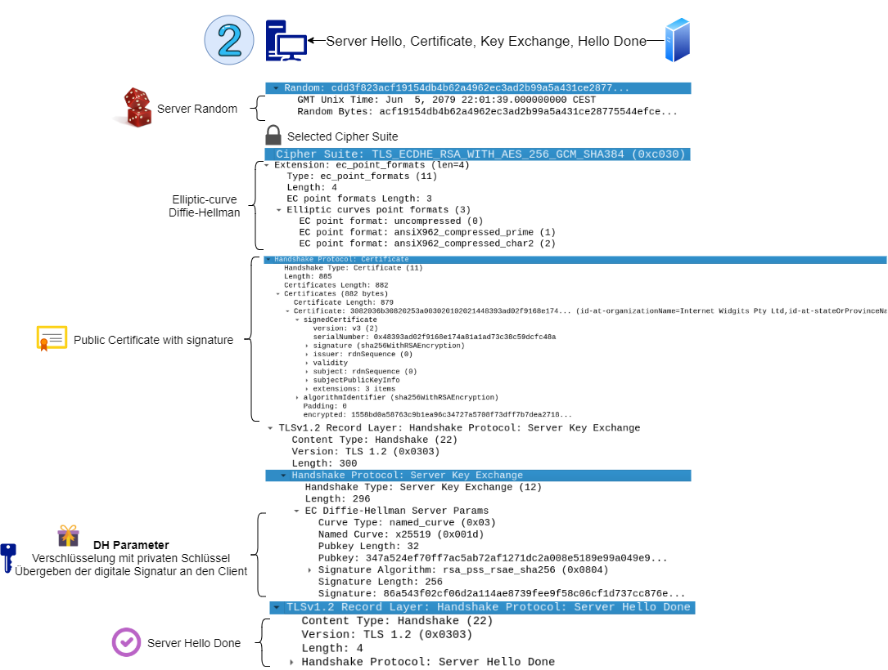

# TechPaper - Extensions of Securing a Web Server 

This Techpaper gives a short overview on how to securely publish a webserver with 'state of the art' technologies in year 2019. 

The author Matthias is a trainee / apprentice in software developement and did a six week stay in the team for information security. 
This paper should be seen as a documentation for a small technical demo Matthias built during this time in DEC 2019.

The paper covers the following topics:

- Deployment of a Dockerhost with Vagrant
- Deployment of Docker with Ansible
- Deployment of a TLS secure HaProxy LoadBalancer in front of Apache Containers

## Theory and Basics

This part covers the theory and basics of TLSv1.2 with screenshots of a Wireshark analysis.
Later on, TLS 1.3 will be introduced to the reader.

### TLSv1.2 Handshake with DH Key Exhange

The following images are inspired by the TLS handshake image at https://www.cloudflare.com/learning/ssl/keyless-ssl/

**Overview of a whole TLS Handshake**

**Client Hello** - The client sends its supported TLS versions, **supported cipher suites** and a **client random** to the server.

**Server Hello** - The server generates a **server secret**. It also selects a cipher supported by the client.
If no matching cipher suite can be found, a downgrade happens.

The selected cipher suite in this case is *TLS_ECDHE_RSA_WITH_AES256_GCM_SHA384*. The cipher provides
PFS properties, so if a private key is exposed, active sessions cannot be unencrypted by an attacker.
ECDHE introduces further security because of the discrete logarithm problem.

The server also sends a **public certificate** with a signature.
A certificate gets signed by a certificate authority to provide integrety.
A browser is configured to trust certain root certificate authorities.

The server chooses its **DH parameters** and signes them with its private key.

If all data is sent, the client recieves a Server Hello Done message.

**Client Key Exchange** - The client verifies the server's public certificate and sends its own DH Parameter.

**Generate Session Key** - Client and server generate a **premaster secret** using the DH parameters they agreed on.
The premaster secret and both randoms are being used to generate a symmetric **session key**.
Also sent is a session ticket for session resumption.

**Symmetric Comunication** - Symmetric encryption is more efficient than asymetric encryption.
Therefore TLS uses a hybrid encryption.

### Benefits of TLS 1.3

- weak cipher suites have been removed
	- favour strong AEAD implementations to assure confidentiallity and authenticity of data
	- no RSA Key Exchange; favour ephemral mode ECDHE
- remove insecure stream ciphers (like RC4) and CBC mode (padding vulnerability)
- more of communication is encrypted
	- all handshake messages after server hello are encrypted
	- prevents downgrading attacks of cipher suites (FREAK attack)
- less roundtrips in communication
	- DHE can happen at client hello (Key-Share)
	- **Client ephemral public Key Share**
	
- predifined DH parameters
	- no weak parameters
	- no small DH parameter
	- prevents LogJam and WeakDH attack
- 0-RTT mode introduced
	- saves roundtrip at client reconnection
	- danger of replay attacks (i.e. a replayed POST request)

To conclude, TLS 1.3 has removed a lot of legacy features, thus providing a stronger protection
for the end-user.

### TLS 1.3 and Network Security

In a company network there are middleboxes for analyzing and monitoring internal and external network traffic.
For TLS 1.2 connections, middleboxes act as a man-in-the-middle and decrypt TLS sessions. With TLS 1.3 more parts of the TLS
handshake are encrypted
and no static server keys can be shared with the middlebox.
Thus, new challenges in network security arise.

Further Reading on this topic:

- https://tools.ietf.org/id/draft-camwinget-tls-use-cases-03.html#sni-encryption-in-tls-through-tunneling

## Implementation and Code Examples

Infrastructure automation is a topic of modern software development.
This chapter covers the provisioning process of a securly configured HAProxy docker container with Vagrant
and Ansible. The goal is to have a fully working development environment with only one command.

All covered files on this topic are documented in detail and marked with a hyperlink.

### Automated Provsioning (Vagrant, Ansible, Docker)

**Vagrant** is used for providing a reproducable development environment.
A [Vagrantfile](../Vagrantfile) for a VirtualBox VM is provided at the project root.
The chosen operating system is a Ubuntu Bionic release from Vagrant Cloud.

To access the webpage running on the VM, a private network is created by Vagrant.
A DHCP server then assigns an IP address to the VM.
In contrast to port forwarding, secure redirects to https work because the ports 80 and 443 stay the same.
Another advantage of a private network is, that you can setup another VM to capture the traffic with a wireshark GUI.
A public IP address may not be used because the VM is configured insecure by default.

Depending on the VM image, all files in project root are synced in a */vagrant* directory.
This feature is very useful for devlopment enviroments as a programmer may want to use his host editor or IDE.
However, this project is more likely to be a playground, so syncing files is not intended.
As an alternative to syncing the project files, they get copied to the VM via Vagrant's file provisioner.

Another provisioner beeing used is *ansible_local*. Ansible is a configuration management tool and provides
configuration as code by writing yaml-based playbooks. A playbook is (re-)played at Vagrant's provision step.
Every task in the playbook should be immutable. By default Vagrant installs Ansible on the VM. Because the 
automated installation fails, [a custom Ansible installation script](../provision/install-ansible.sh) is provided.

**Ansible** configures the Virtual Machine by installing Docker and Docker Compose
as also generating certificates and starting the required Docker Containers.
All the required tasks are defined in the [playbook.yml](../provision/playbook.yml).

**Docker** and **Docker Compose** are not necessary for running the server infrastructure, but they simplify the deployment process.
In contrast to starting all docker containers via command line, 
a [docker-compose.yml](../src/docker-compose.yml) defines all required services.

## Configuration HaProxy and TLS

Basic configuration advice from a previous apprentice has been taken into account.
You may want to read his article first.

For a secure web server configuration I can recommend
[the Mozilla SSL configuration generator](https://ssl-config.mozilla.org/#server=haproxy&server-version=1.9.8&config=modern)
as a starting point.

A lot of configuration is documented in the [haproxy-tls1_2.cfg configuration file](../src/haproxy-tls1_2.cfg)

OWASP O-Saft is a tool used for improving the TLS configuration of the web server.
For a simple setup, a preconfigured Docker container gets provisioned with Docker Compose.

### Remark on HTTP Public Key Pinning

Please note that HTTP public key pinning is not covered in this project.
If you wish to protect yourself from compromised CAs, another *set-header* configuration for the *Public-Key-Pins* header is required.
Also think about a backup certificate and be careful as a misconfiguration can lock out a user from your web page.
A misconfiguration can also disable key pinning completely.
I can recommend the apprentice's article and the Mozilla documentation (https://developer.mozilla.org/de/docs/Web/Security/Public_Key_Pinning) for more details on this topic.

### Remark on internal secure server communication

In this project, the internal communication between HAProxy and both Apache web servers happens unencrypted.
This can lead to security problems, espacially when sensitive data is exchanged.
You might consider to create your own certificates for internal use.

The use of self signed certificates for your own infrasture is great, as you trust yourself the most.
There is also no risk of a certificate authority beeing compromised by an attacker.

If you have Vault in your infrastructure, you can make use of the PKI secret backend.
It manages the root CA, intermidiate CAs and ceritificates for you. 

## Index Of Abbreviations

| Abbrevitation | Meaning |
|-|-|
| AEAD | Authenticated Encryption with Additional Data |
| CA | Cerificate Authority |
| DHE | Diffie Hellmann Exchange |
| ECDHE | Elliptic-curve Diffie-Hellman |
| PFS | Perfect Forward Secrecy |
| VM | Virtual Machine |
| 0-RTT | Zero Round Trip Time Resumption |

## Furher Reading

- https://www.cloudflare.com/learning/ssl/what-happens-in-a-tls-handshake/
- https://www.cloudflare.com/learning/ssl/keyless-ssl/
- https://blog.cloudflare.com/rfc-8446-aka-tls-1-3/
- https://www.owasp.org/images/b/bd/Richtig_verschluesseln_mit_SSL%2BTLS.pdf
(Presentation of the OWASP O-Saft Tool and recommandations for strong encryption)
- https://www.bsi.bund.de/SharedDocs/Downloads/DE/BSI/Publikationen/TechnischeRichtlinien/TR02102/BSI-TR-02102-2.pdf?__blob=publicationFile&v=7 (German)
